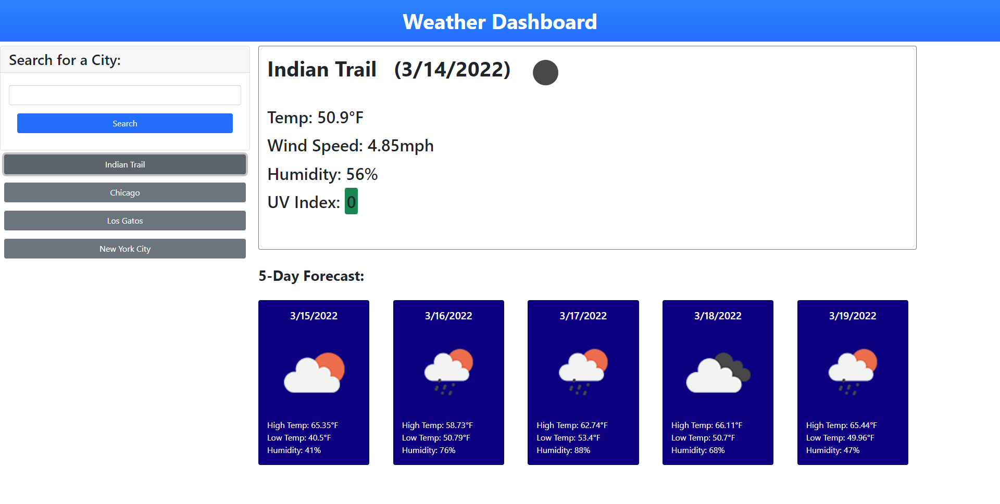

# Weather Dashboard

## Description

This is a weather dashboard that can be used to search the current and 5 day forecasted weather for cities searched by a user.  Weather data is fetched using the OpenWeather API. Cities searched are saved into local storage and displayed in list format as buttons so the user can easily search these same cities again later by simply clinking on the botton.  

## Languages Used

- HTML
- CSS
- JavaScript

## Third-Party APIs Used

- jQuery
- Bootstrap
- moment.js

## Screenshot
   

## Deployment Link

https://uncgirl02.github.io/proj6-EE-weather-dashboard/